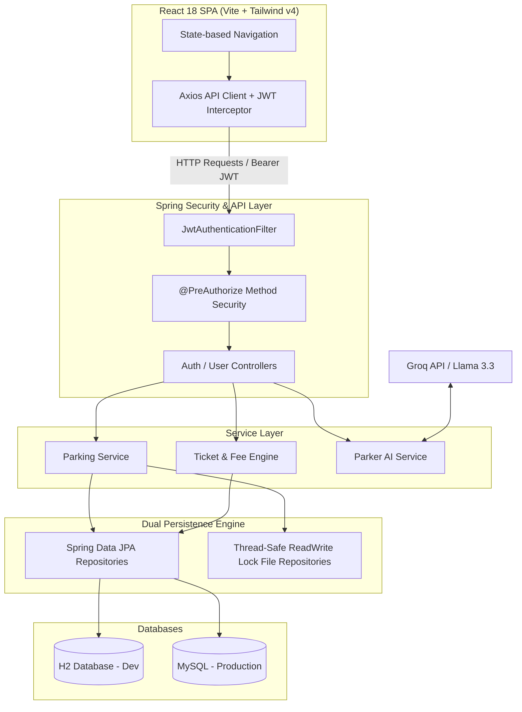

<div align="center">


# ParkPulse

### Full-Stack Parking Management System & AI Assistant

ParkPulse is a real-time parking operations platform for managing slots, tickets, memberships, billing, and staff workflows in one place. It combines a Spring Boot backend, a React frontend, and an AI assistant to support both operators and members.

<br/>

[](#award--recognition)
[](https://spring.io/projects/spring-boot)
[](https://www.oracle.com/java/)
[](https://react.dev/)
[](https://www.typescriptlang.org/)
[](https://tailwindcss.com/)
[](https://groq.com/)

<br/>

[Key Features](#features-breakdown) • [System Architecture](#system-architecture) • [Getting Started](#getting-started) • [Default Credentials](#default-credentials)

</div>

---

## Award & Recognition

> **Award Winner:** Honored with a **Certificate of Excellence** for Full-Stack System Architecture, Real-Time Software Engineering, and Practical AI Integration.

---

## System Overview

ParkPulse addresses real-world operational challenges in modern parking facilities by unifying physical access flows with a digital management system.

### For Drivers & Members
- 6-step registration wizard
- ZXing-generated personal QR parking passes
- Subscription renewal tracking
- Multi-vehicle management
- Real-time slot reservation

### For Operators & Administrators
- Color-coded zone occupancy maps
- Automated time-based ticketing
- Card and cash checkout processing
- Granular role-based access control
- Operational monitoring and reporting

---

## Features Breakdown

<table align="center">
  <tr>
    <td align="center" width="33%">
      <strong>Live Interactive Map</strong><br/>
      Color-coded slot states (Available / Taken / Reserved / Maintenance), 6 customized zones, overflow alerts, auto-release timers.
    </td>
    <td align="center" width="33%">
      <strong>Automated Ticketing & Billing</strong><br/>
      Dynamic rate calculations by vehicle type (CAR, SUV, MOTORCYCLE, TRUCK, VAN), with card/cash checkout flows.
    </td>
    <td align="center" width="33%">
      <strong>Memberships & QR Passes</strong><br/>
      3 subscription tiers (Basic / Professional / Premium) with monthly/annual savings calculators and instant ZXing QR pass rendering.
    </td>
  </tr>
  <tr>
    <td align="center" width="33%">
      <strong>Parker AI Assistant</strong><br/>
      Context-aware Groq Llama-3.3 chatbot providing role-gated analytics queries for staff and subscription assistance for members.
    </td>
    <td align="center" width="33%">
      <strong>Granular RBAC Security</strong><br/>
      Stateless JWT authentication (HS256) supporting 5 access tiers, 14 custom permissions, session timeouts, and lockout policies.
    </td>
    <td align="center" width="33%">
      <strong>Recharts Analytics</strong><br/>
      Visual dashboards for peak-hour histograms (24h), weekly traffic flows, revenue distribution, and member status breakdown.
    </td>
  </tr>
</table>

---

## System Architecture

ParkPulse implements a layered backend architecture paired with a dual-persistence storage engine and an asynchronous SPA client on the frontend.



---

## Getting Started

### Prerequisites
- Java 17+
- Node.js 18+
- npm
- MySQL (for production use)

### Backend
```bash
./mvnw spring-boot:run
```

### Frontend
```bash
cd frontend
npm install
npm run dev
```

### Configuration
Set any required environment variables before running the app, including:
- database connection settings
- JWT secret
- Groq API key

---

## Default Credentials

> Add the default demo/admin credentials here so new users can log in quickly.

| Role | Username | Password | Notes |
| --- | --- | --- | --- |
| Admin | `admin` | `admin123` | Replace with your actual default values |
| Operator | `operator` | `operator123` | Replace with your actual default values |
| Member | `member` | `member123` | Replace with your actual default values |

---

## Suggested Next Improvements

- Add screenshots or a demo GIF for the dashboard and AI assistant.
- Document environment variables in a dedicated section.
- Add API docs or Swagger/OpenAPI links.
- Add a Contributing section and license information.
